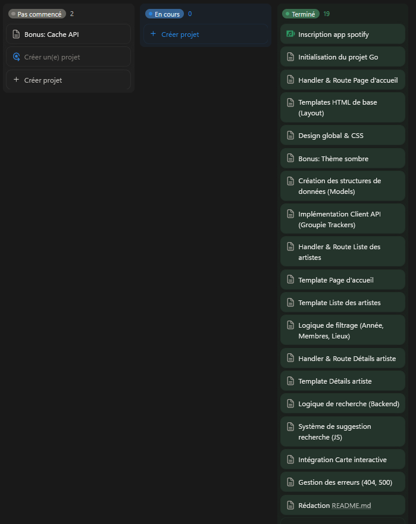

# Spotify-mais-sans-la-musique (SMSM)

Un projet Web développé en **Go (Golang)** qui permet d'explorer des artistes musicaux, de consulter leurs détails et de trouver des concerts à venir en utilisant les APIs de Spotify et Ticketmaster.

## 🚀 Fonctionnalités

- **Accueil interactif** : Mise en avant d'artistes populaires et suggestions.
- **Catalogue d'artistes** : Exploration et liste des artistes disponibles.
- **Détails Artiste** : 
  - Affichage des informations de l'artiste (images, popularité, genres).
  - Liste des "Top Tracks".
- **Recherche** : Recherche d'artistes spécifiques.
- **Concerts (Ticketmaster)** : Localisation des prochains concerts et événements liés aux artistes.
- **Interface Utilisateur** :
  - Thème clair/sombre (Dark mode).
  - Design responsive.

## 🛠️ Stack Technique

- **Backend** : Go (Golang).
- **Frontend** : HTML (Templates), CSS, JavaScript.
- **APIs Externes** :
  - [Spotify Web API](https://developer.spotify.com/documentation/web-api/) (Données artistes & musiques).
  - [Ticketmaster API](https://developer.ticketmaster.com/products-and-docs/apis/discovery-api/) (Événements & concerts).

## 📋 Prérequis

Avant de commencer, assurez-vous d'avoir installé :
- [Go](https://go.dev/dl/) (version 1.25 ou compatible).
- Un compte développeur **Spotify** pour obtenir un Client ID et Client Secret.
- un compte développeur **Ticketmaster** pour obtenir une clé API.

## ⚙️ Installation et Configuration

1. **Cloner le projet**
   ```bash
   git clone <votre-url-repo>
   cd Spotify-mais-sans-la-musique
   ```

2. **Configurer les clés API**
   Créez un fichier nommé `config.json` à la racine du projet et remplissez-le avec vos identifiants :

   ```json
   {
       "API": {
           "Spotify_key": "VOTRE_SPOTIFY_CLIENT_SECRET",
           "Spotify_app": "VOTRE_SPOTIFY_CLIENT_ID",
           "Ticketmaster_key": "VOTRE_TICKETMASTER_API_KEY"
       },
       "DEBUG": true
   }
   ```

3. **Installer les dépendances**
   ```bash
   go mod tidy
   ```

## ▶️ Lancement de l'application

Lancez le serveur avec la commande suivante :

```bash
go run cmd/main.go
```

Une fois le serveur démarré, ouvrez votre navigateur et accédez à :
👉 **http://localhost:8080**

## 📂 Structure du projet

```
SMSM/
├── cmd/
│   └── main.go          # Point d'entrée de l'application
├── internal/
│   ├── api/             # Gestion des appels API (Spotify, Ticketmaster)
│   ├── config/          # Gestion de la configuration (chargement du JSON)
│   └── route/           # Définition des handlers HTTP et logique des pages
├── pkg/
│   └── utils/           # Fonctions utilitaires (Logs, formatage)
├── static/              # Ressources statiques (CSS, JS, Images)
├── template/            # Templates HTML
├── config.json          # Fichier de configuration (à créer)
└── go.mod               # Gestion des dépendances Go
```

## 🌐 Routes de l'application

| Route | Description |
| :--- | :--- |
| `/` | Page d'accueil avec suggestions et artistes populaires. |
| `/artistes` | Catalogue complet des artistes disponibles. |
| `/search` | Résultat de la recherche d'un artiste. |
| `/artiste/{id}` | Page de détail d'un artiste (infos, musiques, concerts). |
| `/concert` | Liste des concerts via Ticketmaster. |

## 📅 Gestion de projet

Le suivi, la roadmap et l'organisation des tâches sont gérés sur **Notion**.

[](https://www.notion.so/2c55676fbcad80188141fcce19b08709?v=2c55676fbcad804da05f000c2a3de9f4&source=copy_link)

🔗 **[Accéder au tableau de bord Notion](https://www.notion.so/2c55676fbcad80188141fcce19b08709?v=2c55676fbcad804da05f000c2a3de9f4&source=copy_link)**

🔗 **[Accéder au dépot Github](https://github.com/leo-gaiguantanquit/Spotify-mais-sans-la-musique)**